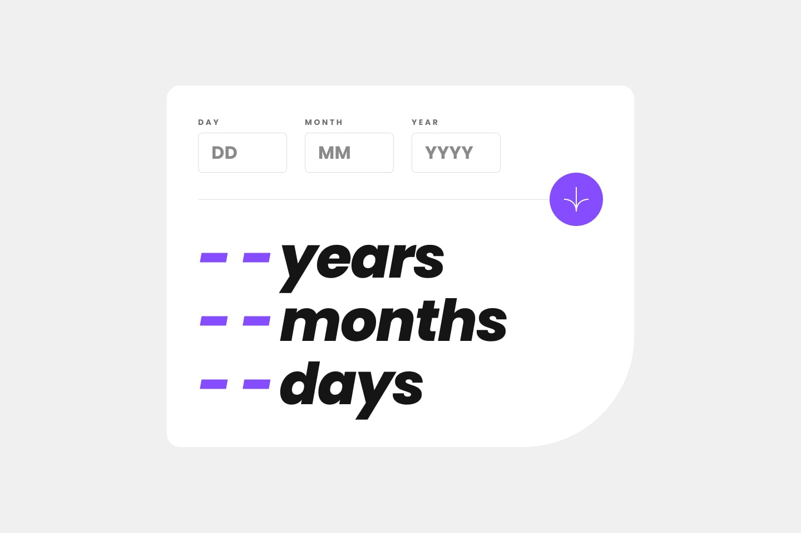
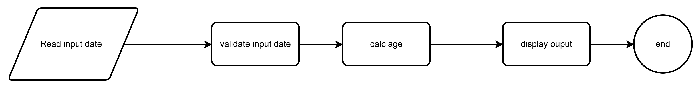

# Age-calculator-app
## Overview
This project is an age calculator application built to practice JavaScript logic, input validation, and UI development using pure HTML, CSS, and JavaScript. The main goal was to implement reliable date handling and create a clean user experience.
### Screenshot

### Flowchart Logic
The project logic was planned using a flowchart to make the implementation clearer and more organized.

### Links
- 🌐 Live Site: https://eng-mohamedhosny.github.io/Age-calculator-app/
- 💻 Repository: https://github.com/Eng-MohamedHosny/Age-calculator-app/

---

## 🚀 Features

### ✅ Date Validation System
The app includes a strong validation layer that handles different input scenarios:

- Empty fields detection → Shows **"This field is required"** message.
- Out of range values:
  - Day must be between 1 and 31.
  - Month must be between 1 and 12.
- Future date prevention → Birth date must be in the past.
- Real calendar validation:
  - Prevents invalid dates like 31st in months that have only 30 days.

---

### ✅ Age Calculation Logic

I gained good experience working with JavaScript Date objects by implementing:

- Year, month, and day difference calculations.
- Borrowing logic when:
  - Days are negative → Borrow from the previous month.
  - Months are negative → Borrow from the previous year.

This helped me understand real-world time arithmetic.

---

### ✅ UI & Responsive Design

- Focused on matching the design specification.
- Centered card layout with proper spacing and typography.
- Styled components using pure CSS (no frameworks).
- Tested responsiveness across different screen sizes.

---

### ✅ Project Structure & Code Organization

- Divided the project logic into clear functional parts:
  - Input handling
  - Validation layer
  - Age calculation engine
  - UI state rendering
  - Error management

This improved readability and maintainability.

---

## 🧠 What I Learned

- Working deeply with JavaScript date manipulation.
- Handling real-world user input edge cases.
- Separating logic into reusable functions.
- Planning program flow using flowcharts before coding.
- Building responsive UI components without frameworks.

---

## 🛠️ Built With

- HTML5  
- CSS3  
- JavaScript (Vanilla JS)

This project was built without using any frontend frameworks.

---

## 👤 Author

- GitHub: [Eng-MohamedHosny](https://github.com/Eng-MohamedHosny)  
- Frontend Mentor: [Eng-Mohamed Hosny](https://www.frontendmentor.io/profile/Eng-MohamedHosny)
